.. _`c2cgp.aide`:

=====
Aide
=====

Vous pouvez aussi consulter notre :ref:`c2cgp.faq`.

Gestion des thèmes
===================

Choix du thème
***************

Le géoportail comporte plusieurs thèmes. Dans chaque thème, il y a des 
groupes de couches. La séléction du thème se fait en cliquant sur le 
rectangle nommé "Thème". En passant d'un thème à l'autre, le niveau de zoom 
et le périmètre affiché sont conservés.

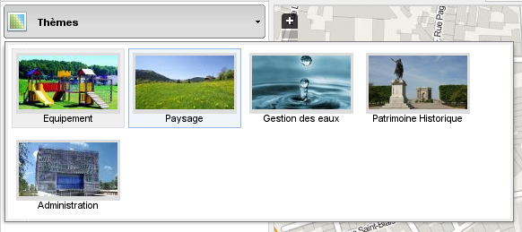

Vous pouvez charger plusieurs thèmes à la fois.

Ouverture / fermeture des groupes
**********************************

Les groupes s'ouvrent et se ferment en cliquant sur le petit triangle (blanc ou noir) à gauche de la dénomination du groupe lorsque vous passez la souris sur le titre du thème. Vous pouvez déplacer un thème au dessus d'un autre en utilisant les flèches de la même manière.

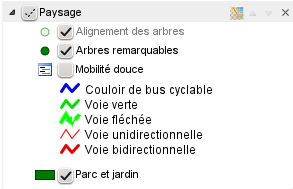

Vous pouvez également gérer l'opacité du thème chargé.

Gestion d'une couche
**********************

* Ajustement de l'échelle |magnifierArrow| : suivant la couche, l'affichage de celle-ci peut être limité à certaine échelle. Si la couche n'est pas visible à une échelle, cela aura pour effet de grisé le nom de la couche. Pour atteindre l'échelle d'affichage, il suffit de cliquer sur le bouton de loupe 
* Consultation de la métadonnée |pageWorld| : la métadonnée permet de consulter la définition de la couche ainsi que la légende complexe. Elle n'est pas forcément définie pour toutes les couches. Un lien vers une description plus complète est propsé (si existant).
* Affichage de la légende |legend| : si la couche est représentée de manière thématique, alors ce bouton permet de consulter la légende. En cliquant de nouveau dessus, cela aura pour effet de fermer la légende.

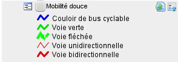

.. |legend| image:: _static/icones/legend.png
   :alt: Ajustement de l'échelle

.. |pageWorld| image:: _static/icones/page_world.png
   :alt: Consultation de la métadonnée

.. |magnifierArrow| image:: _static/icones/magnifier--arrow.png
   :alt: Ajustement de l'échelle

Fonctionnalités disponibles
============================

Clique-droit dans la carte
*****************************

En cliquant dans la carte en utilisant le bouton de droite de la souris ([ctrl]+clique sur Mac), il est possible de faire une interrogation ponctuelle de diverses données, notamment :

* Coordonnées Mercator : coordonnées du point cliqué dans le système de référence pseudo-mercator
* WGS 84: coordonnées longitude / latitude (WGS84) du point cliqué (calculé à partir des coordonnées Mercator)
        

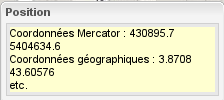

À noter qu'il est possible d'extraire les valeurs altimétriques à partir d'une paire de coordonnées.

Navigation sur la carte
************************

Utiliser les 4 premiers boutons de la barre d'outils au dessus de la carte.

* La première icône |arrowInout| permet de revenir à l'étendue initiale de la carte.
* Les deux boutons suivants |magnifierZoomIn| et |magnifierZoomIn| permettent de 
  zoomer et dézoomer. Si vous avez une molette sur votre souris, celle-ci peut 
  aussi être utilisée à cet effet.
* Pour **interroger la carte** il vous suffit de cliquer une fois sur la 
  carte ou d'utiliser le Ctrl + drag and drop pour dessiner une zone 
  d'interrogation. Les couches interrogeables renverront les informations 
  de l'endroit où vous avez cliqué.
  Le résultat de l'interrogation est présenté dans une nouvelle fenêtre. 
  Si vous avez sélectionné plusieurs objets (par exemple en dessinant un 
  rectangle) ou que plusieurs couches interrogeables se superposent, le 
  résultat sera multiple. Pour naviguer dans les résultats, il faut utiliser 
  l'arborescence entre les groupes et les entités. 
  L'objet pour lequel les informations sont inscrites dans la fenêtre est coloré en rouge sur la carte. 
  
  .. image:: _static/aide/c2cgp_featureswindow.png
      :class: ombrage
      :alt: Interrogation
      :align: center

* Les deux boutons flèche |arrowLeft| et |arrowRight| permettent de consulter 
  l'historique de navigation. C'est-à-dire aller sur une vue précédente et 
  ensuite revenir à la dernière vue.

.. |arrowInout| image:: _static/icones/arrow_inout.png
   :alt: Zoom sur extend

.. |magnifierZoomIn| image:: _static/icones/magnifier_zoom_in.png
   :alt: Zoomin

.. |magnifierZoomOut| image:: _static/icones/magnifier_zoom_out.png
   :alt: ZoomOut

.. |arrowLeft| image:: _static/icones/arrow_left.png
   :alt: Vue précédente

.. |arrowRight| image:: _static/icones/arrow_right.png
   :alt: Vue suivante

Mesures
**********

Les outils de mesures sont disponibles à partir du menu d'outils de mesure :

.. image:: _static/aide/c2cgp_measuremenu.png
   :class: ombrage
   :alt: menu outils mesure
   :align: center

* Le bouton |coordPoint| affiche les coordonnées du point en deux systèmes 
  différents (Pseudo-Mercator et système géographique).
* Le bouton |ruler| permet de mesurer des distances. Effectuez plusieurs 
  cliques sur la carte pour créer un chemin. Pour terminer la mesure, 
  faites un double-clique.
* Le bouton |rulerSquare| permet de mesurer des surfaces. Effectuez plusieurs 
  cliques sur la carte pour créer un polygone. Pour terminer la mesure, 
  faites un double-clique.

.. |coordPoint| image:: _static/icones/bullet_orange.png
   :alt: coordonnées point

.. |ruler| image:: _static/icones/ruler.png
   :alt: Mesure de longueur

.. |rulerSquare| image:: _static/icones/ruler_square.png
   :alt: Mesure de surface

Profil d'altitude
*******************

Le bouton |profil| permet de faire un profil d'altitude. Cliquez plusieurs 
fois sur la carte pour créer un chemin. Pour le dernier point, faites un 
double-clique. Une fois le graphique affiché, vous pouvez cliquer sur la 
courbe pour voir la position d'un point du graphique sur la carte. Dans la 
fenêtre du profil, le bouton "Exporter CSV" permet d'exporter les valeurs XY 
du profil dans un fichier texte CSV (comma separated values).

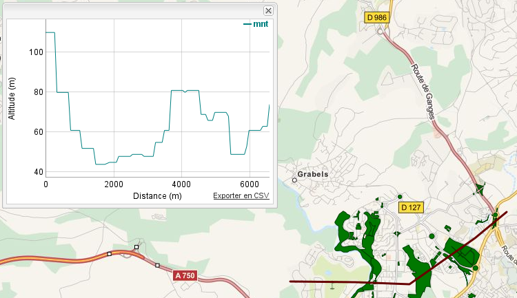

.. |profil| image:: _static/icones/chart_line.png
   :alt: Profil altimétrique

3D
****

Le bouton |googleEarth| permet d'ouvrir le module 3D Google Earth. Celui-ci doit 
être installé sur votre machine (sinon l'application vous demandera de le 
faire). L'activation de ce module aura pour effet d'inclure une ligne rouge sur 
la carte. Le point rouge illustre le point qui est regardé, alors que l'oeil 
montre depuis où le point est regardé. Vous pouvez bouger le point et naviguez 
autour de ce dernier en bougeant l'oeil.

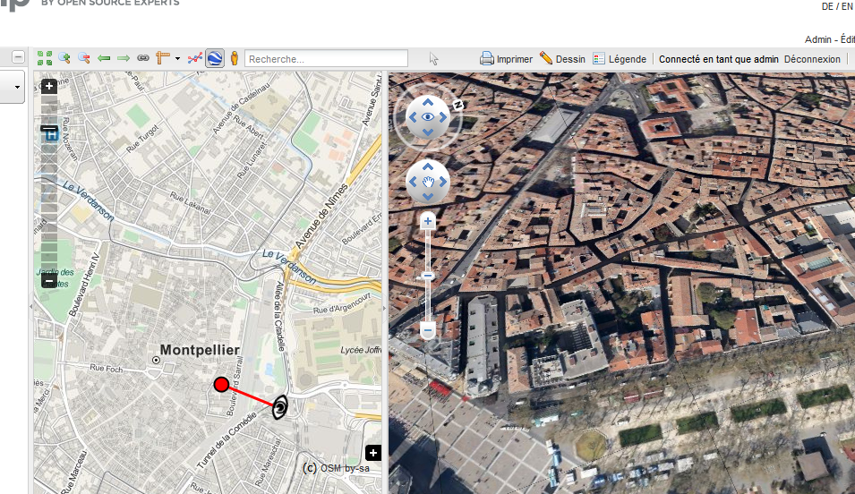

.. |googleEarth| image:: _static/icones/google_earth.png
   :alt: 3D Google Earth

Streetview
***********

Le bouton |streetview| permet d'ouvrir le module Streetview de Google. Une fois 
le module ouvert, cliquez encore à un endroit sur la carte pour indiquer une 
position à explorer. Si la position n'a pas été relevée par Google, cela vous 
sera indiqué. Sinon, une icône composée de flèches noires et d'une flèche 
blanche au centre paraîtra dans le carte. Les flèches noires vous indiquent les 
sens de navigation possible. En cliquant dessus vous pouvez vous déplacer. La 
flèche blanche vous indique dans quelle direction est orientée l'image dans Google 
Streetview.

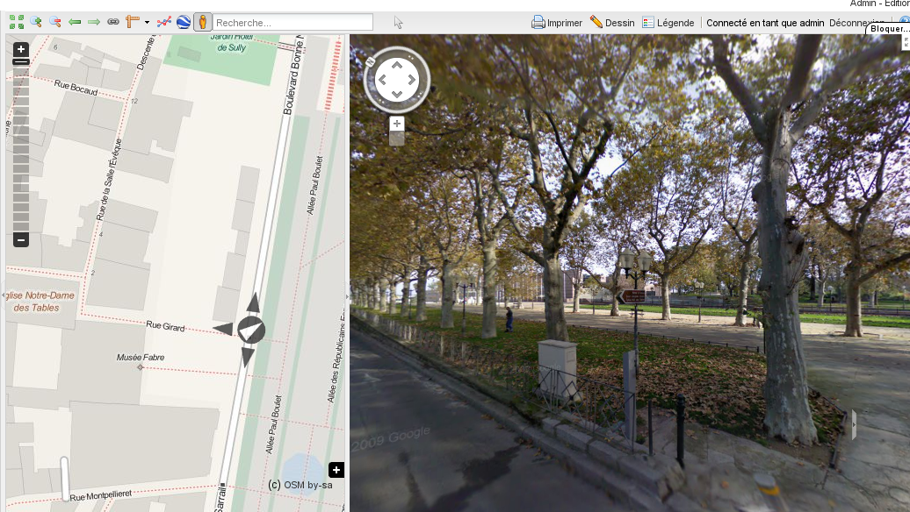

.. |streetView| image:: _static/icones/streetview.png
   :alt: Google Streetview

Recherche
**********

La barre de recherche permet d'effectuer des recherches de communes, 
départements, régions ou adresses. La base de données adresse est 
constitué des données Open Data des villes incluses dans le portail. 
Les mots-clés 

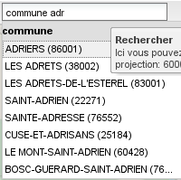

Autres fonctionnalités
========================

Lien
******

Le bouton lien |permalink| permet d'ouvrir une option contenant un lien sur la 
carte telle qu'elle est affichée dans votre navigateur (avec les même couches, 
le même niveau de zoom et au même endroit). Vous pouvez copier-coller ce lien 
dans un mail pour transmettre votre carte.

Voici un `exemple de lien <http://yjacolin.int.lsn.camptocamp.com/yjn_demo/wsgi/theme/Administration?map_x=430866.16317473&map_y=5405525.5559428&map_zoom=18&tree_group_layers_Patrimoine%20Historique=sitesclasses%2Cfontaines%2Cmonuments&tree_group_layers_Paysage=espaces_verts&tree_groups=Patrimoine%20Historique%2CPaysage&baselayer_opacity=100&baselayer_ref=OSM_MapQuest>`_

.. |permalink| image:: _static/icones/permalink.png
   :alt: Lien

Impression
***********

Le bouton d'impression |printer| 
permet d'imprimer les couches visible sur la carte (y compris les objets 
dessinés) dans un fichier PDF ou png. En cliquant sur le bouton, le panneau de 
configuration de l'impression s'ouvre. Dans ce dernier vous pouvez définir la 
taille de la page, la résolution d'impression, le titre, un commentaire, 
l'échelle et l'orientation de l'impression. À noter que vous pouvez aussi 
modifier l'échelle directement en modifiant le cadre jaune dans la carte. 
Ce cadre peut aussi être déplacé en maintenant le bouton de votre souris 
enfoncé et en déplaçant celle-ci.

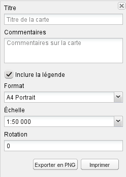

.. |printer| image:: _static/icones/printer.png
   :alt: Impression

Dessin
******

Le bouton de dessin |paintbrush| permet d'ouvrir la palette des outils de dessin :

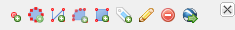

.. |paintbrush| image:: _static/icones/paintbrush.gif
   :alt: Dessin

* Créer un point |bulletRedAdd| : cliquez sur ce bouton pour dessiner un point 
  dans la carte. Suite au dessin, une fenêtre s'ouvre. Celle-ci vous permet 
  pour l'instant de seulement modifier la couleur du point.
* Créer une ligne |lineRedAdd| : cliquez sur ce bouton pour dessiner une ligne 
  dans la carte. Cliquez plusieurs fois sur la carte pour dessiner une ligne. 
  Pour le dernier point, faites un double-clique. Suite au dessin, une fenêtre 
  s'ouvre. Celle-ci vous permet pour l'instant de seulement modifier la 
  couleur de la ligne.
* Créer un polygone |shapeSquareRedAdd| : cliquez sur ce bouton pour dessiner 
  un polygone dans la carte. Cliquez plusieurs fois sur la carte pour dessiner 
  un polygone. Pour le dernier point, faites un double-clique. Suite au dessin, 
  une fenêtre s'ouvre. Celle-ci vous permet pour l'instant de seulement 
  modifier la couleur du polygone.
* Créer une étiquette |tagBlueAdd| : cliquez sur ce bouton pour créer une 
  étiquette à quelque part dans la carte. Cliquez dans la carte pour 
  positionner votre étiquette. Suite au dessin, une fenêtre s'ouvre. 
  Celle-ci vous permet pour l'instant de seulement modifier le texte de 
  l'étiquette (pas de choix de taille, ni de police).
* Éditer un objet existant |pencil| : cliquez sur ce bouton pour modifier un 
  élément déjà dessiner que vous aimeriez modifier. Cliquez sur l'objet en 
  question dans la carte, puis effectuer vos modifications. Pour les lignes et 
  les polygones, tous les cliques que vous avez effectué lors du dessin 
  apparaissent sous forme de points rouges. Vous pouvez rajouter des segments 
  supplémentaire en cliquant sur les points rouges qui sont un peu plus 
  transparents et affiner ainsi votre dessin.
* Effacer tous les objets |delete| : cliquez sur ce bouton pour effacer tous les 
  objets que vous avez dessiné (attention, ces dessins seront définitivement 
  effacés).
 
.. |bulletRedAdd| image:: _static/icones/bullet_red_add.png
   :alt: Ajouter un point

.. |lineRedAdd| image:: _static/icones/line_red_add.png
   :alt: Ajouter une ligne

.. |shapeSquareRedAdd| image:: _static/icones/shape_square_red_add.png
   :alt: Dessiner un polygone

.. |tagBlueAdd| image:: _static/icones/tag_blue_add.png
   :alt: Créer une étiquette

.. |pencil| image:: _static/icones/pencil.png
   :alt: Éditer un objet existant

.. |delete| image:: _static/icones/delete.png
   :alt: Effacer tous les objets

Les objets dessinés peuvent être exportés au format KML. Ils sont également 
pris en compte lors de l'impression.

Édition
********

Le lien d'édition ouvre la page d'édition. Celle-ci est accessible par tout le 
monde mais **seule les personnes authentifiées pourront éditer les couches** que 
l'administrateur des données aura définie comme éditable.

Choisissez d'abord un thème puis définissez la couche à éditer via la liste 
déroulante pour ajouter un nouvel objet ou cliquez sur une géométrie sur la 
carte pour l'éditer.

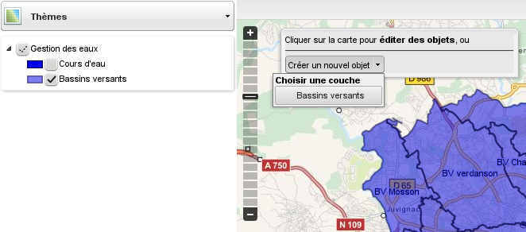

Administration
*****************
La console d'administration est elle aussi accessible après authentification. 
Elle permet d'ajouter des couches, des groupes de couches, des thèmes, des 
utilisateurs, des groupes d'utilisateurs, des zones de restrictions et de 
configuré des fonctionnalités différemment par groupe d'utilisateurs.

.. note:: Pour tout renseignement supplémentaire, question ou remarque, merci de contacter Camptocamp.

