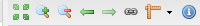
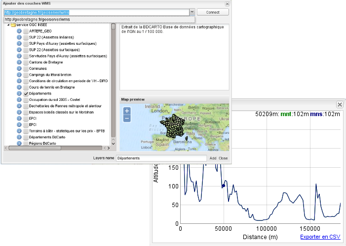
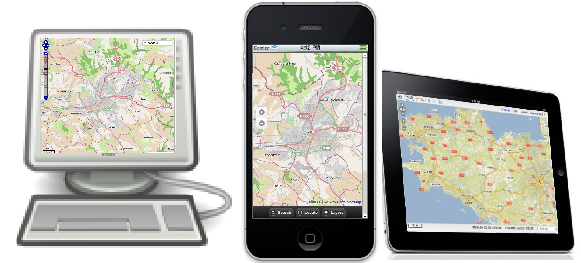

.. FormationPylons documentation master file, created by
   sphinx-quickstart on Fri Feb 19 11:51:27 2010.
   You can adapt this file completely to your liking, but it should at least
   contain the root `toctree` directive.

.. raw:: html
   
   
   
   
   <link  media="screen" type="text/css" rel="stylesheet" href="_static/css/slides.css">

=========================================
Un géoportail pour vos collectivités
=========================================

.. raw:: html
   :file: slides.html

.. raw:: html
   
   

Vous souhaitez vous faciliter la mise en place d'un portail cartographique de 
vos données ? Intégrer des cartes au sein de votre CMS rapidement et 
facilement ? Gérer des utilisateurs et des zones de visibilités pour chacun 
d'eux ? Avoir un portail performant et maintenable ?

Publier vos données facilement et rapidement sur différents médias n'a jamais 
été aussi facile. 

Présentation des fonctionnalités
===================================

En effet c2cgeoportal vous permet d'afficher une carte au sein d'une 
application indépendante, au sein de vos pages web et sur mobile avec 
une seule interface de gestion.

Intégrer vos cartes dans une page HTML est possible grâce aux deux API 
(simple et avancé) et quelques lignes de codes.

Quelques fonctionnalités parmi d'autres :

* Calcul de profil
* Interaction avec les API Google Earth et Street View
* Ajout de couches WMS distantes
* Recherche dynamique attributaire et géométrique par couche
* Édition de couches
* Version mobile
* Impression PDF et png
* Restriction par zones ou par couches
* Gestion d'utilisateur et de groupe d'utilisateur

Des fonctionnalités standards et avancées
*******************************************

Le Geoportail Mapfish propose les outils de navigations et de calcul standard : déplacer 
la carte, zoomer, dézoomer, revenir à l'étendue initiale, calcul de surface et de 
distance.

D'autres outils plus avancés sont disponibles. Afficher une vue Google Earth 3D, 
calcul de profil en long, export PDF et image de la carte, outils de dessin, toutes 
ces fonctionnalités sont proposées en option.

Une interface modulable et personnalisable
********************************************

GeoPortal MapFish propose plusieurs interfaces totalement modulable ! Une interface 
classique proposant un certain nombre de fonctionnalités, certaines par défaut, d'autres 
ajoutées par l'intégrateur ; deux API permettant une intégration parfaite au sein 
d'un CMS par exemple ; une interface adaptée aux médias mobiles.

Bien sur d'autres interfaces peuvent être réalisées tout en utilisant les 
fonctionnalités du moteur (notamment la gestion des utilisateurs et des accès).

Une gestion avancée
*********************

L'application est gérée via l'application d'administration : ajout de couche, création 
d'utilisateur, de groupe, définition d'une zone de restriction géographiques et 
thématiques des données pour un groupe d'utilisateurs.

Le développement de cet outil est réalisé en continu et d'autres 
fonctionnalités sont prévues, `contacter nous <mailto:info+demo@camptocamp.com>`_ 
pour vous tenir informer.

.. Quelques références
.. =====================
.. 
.. En Suisse
.. **********
.. 
.. SIGIP : SIG intercommunal de Pully, Paudex et Belmont
.. ------------------------------------------------------
.. 
.. SIGIP est le portail cartographique intercommunal de Pully, Paudex et Belmont 
.. dans le canton de Vaud en Suisse.
.. 
.. * URL : http://www.sigip.ch
.. * Mise en production : début 2013
.. 
.. BL GeoView
.. ------------
.. 
.. * URL : http://geoview.bl.ch/
.. * Mise en production : fin 2012
.. 

.. toctree::
   :maxdepth: 1
   :hidden:

   aide
   videos
   faq
   api
   xapi
   

